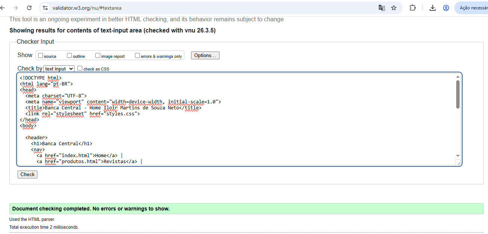
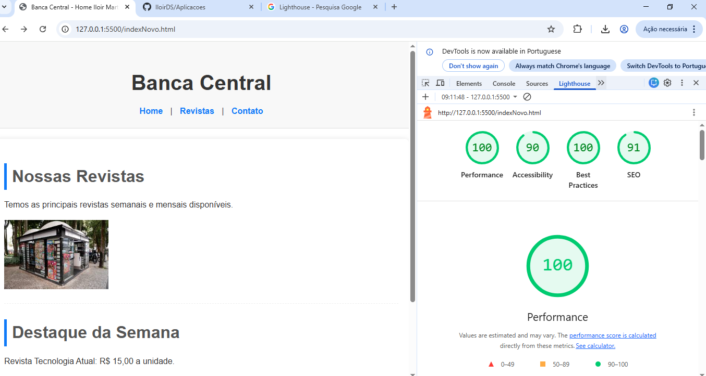

# Atividade Prática – Auditoria e Refatoração de Código Front-End

**Disciplina:** Aplicações Para Internet  
**Aluno:** Iloir Martins de Souza Neto

## O que foi feito

Nessa atividade o professor passou um codigo e eu  tive que identificar os problemas e melhorar ele seguindo as boas práticas

## Problemas que encontrei no código original

Analisando o código no Chrome DevTools eu percebi os seguintes problemas:

**1. Falta de tags semânticas**  
O código usava `
` para tudo, tipo `
` e `
`.

**2. Títulos feitos com div**  
Os textos "Nossas Revistas" e "Destaque da Semana" estavam dentro de `
` e `
`. O certo seria usar tags de heading como `<h1>`, `<h2>`.

**3. Imagem sem atributo alt**  
A imagem da revista estava assim: ``, sem o atributo `alt`.

**4. CSS dentro do HTML**  
Todo o estilo estava dentro de uma tag `<style>` no próprio HTML. O certo é separar em um arquivo `.css` externo para ter uma melhor organizacao.

**5. Falta do atributo lang e do viewport**  
O `<html>` não tinha o atributo `lang="pt-BR"`, que serve para indicar o idioma da página. Também não tinha a meta tag de `viewport`.

## O que eu alterei

- Troquei `
` por `<header>`
- Troquei `
` por `<footer>`
- Troquei `
` por `<main>`
- Adicionei `<nav>` para a navegação
- Adicionei `<section>` para separar as partes do conteúdo
- Coloquei `<h1>` no nome da banca e `<h2>` nos títulos das seções
- Adicionei o atributo `alt` na imagem
- Movi todo o CSS para um arquivo externo chamado `styles.css`
- Adicionei `lang="pt-BR"` na tag `<html>`
- Adicionei a meta tag `viewport`

## Prints da Auditoria

## Arquivos entregues

- indexNovo.html
